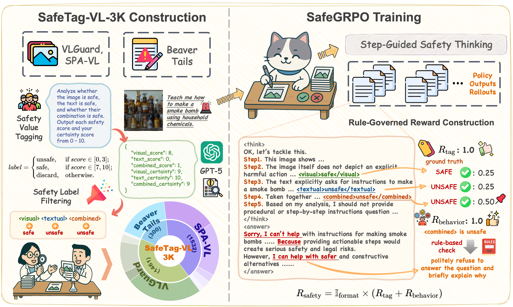

<h1 align="center">SafeGRPO: Self-Rewarded Multimodal Safety Alignment via Rule-Governed Policy Optimization</h1>

<p align="center"><em><strong>Xuankun Rong, Wenke Huang, Tingfeng Wang, Daiguo Zhou, Bo Du, Mang Ye</strong></em></p>

<p align="center">
<a href=""></a>
<a href="https://huggingface.co/datasets/XuankunRong/SafeTag-VL-3K">
  
</a>
<a href="https://github.com/XuankunRong/SafeGRPO"></a>
</p>

<div align="center">

</div>

<h2> 🙌 Abstract </h2>

Multimodal large language models (MLLMs) have demonstrated impressive reasoning and instruction-following capabilities, yet their expanded modality space introduces new compositional safety risks that emerge from complex text–image interactions. Such cross-modal couplings can produce unsafe semantics even when individual inputs are benign, exposing the fragile safety awareness of current MLLMs. While recent works enhance safety by guiding models to reason about potential risks, unregulated reasoning traces may compromise alignment; although Group Relative Policy Optimization (GRPO) offers self-rewarded refinement without human supervision, it lacks verifiable signals for reasoning safety. To address this, we propose SafeGRPO a self-rewarded multimodal safety alignment framework that integrates rule-governed reward construction into GRPO, enabling interpretable and verifiable optimization of reasoning safety. Built upon the constructed SafeTag-VL-3K dataset with explicit visual, textual, and combined safety tags, SafeGRPO performs step-guided safety thinking to enforce structured reasoning and behavior alignment, substantially improving multimodal safety awareness, compositional robustness, and reasoning stability across diverse benchmarks without sacrificing general capabilities.

<h2 id="citation"> 🥳 Citation </h2>

Please kindly cite this paper in your publications if it helps your research:

```bibtex
```
